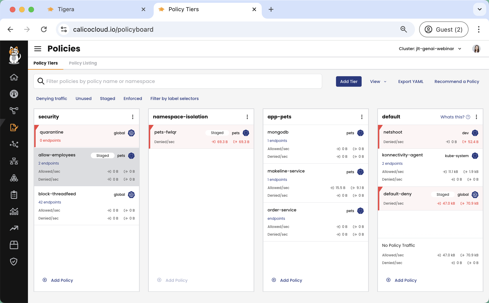
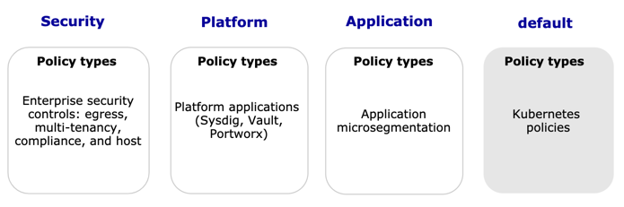

# Module 2 - Introduction to Tiers

Calico allows hierarchical grouping of policies into tiers. Policy tiers allow enforcement of higher-precedence policies that cannot be circumvented by other teams. Policy tiers are evaluated based on order, as are policies within each tier. Graphically (in Calico Cloud Free Tier), policies are evaluated from left to right, top to bottom. RBAC for each tier can be defined to restrict who can interact with each tier.



1. Check which tiers already exist in the cluster:

   ```bash
   kubectl get tiers
   ```
2. Describe two of the tiers to:

   ```bash
   kubectl describe tier default
   ```

   ```bash
   kubectl describe tier default
   ```

3. Notice the differences in the spec of each of the tiers. The `default` tier has a default action of `Deny`, and an order of `1,000,000`.

```YAML,nocopy
Spec:
  Default Action:  Deny
  Order:           1000000
```

The `baselineadminnetworkpolicy` tier has a default action of `Pass`, and an order of `10,000,000`.

```YAML,nocopy
Spec:
  Default Action:  Deny
  Order:           1000000
```

The order number of the tiers shows that policies in the `default` tier will get evaluated before the `baselineadminnetworkpolicy`, *however* the default action of the `default` tier is `Deny`, so if any traffic is evaluated by all policies in that tier and doesn't match, and it gets to the bottom of the tier, it will be denied. Any traffic that makes it to the bottom of the `baselineadminnetworkpolicy` tier will get passed onto the next tier for evaluation. 

>AdminNetworkPolicies and BaselineAdminNetworkPolicies are based on two APIs introduced by the Kubernetes network policy API. The AdminNetworkPolicy helps administrators set strict security rules for the cluster, i.e. a developer cannot override these rules. The BaselineAdminNetworkPolicy allows administrators to set baseline security rules that can be overridden by developer NetworkPolicies if needed. 

4. Create new tiers

In the `/manifests` folder is a `tiers.yaml` file. View it to see what a tier definition looks like:

```cat manifests/tiers.yaml```

Apply the new tiers:

```kubectl apply -f manifests/tiers.yaml```

You should see three new tiers created:

```bash,nocopy
tier.projectcalico.org/security created
tier.projectcalico.org/platform created
tier.projectcalico.org/application-catfacts created
```



## Best practices for tiered policy
To control and authorize access to Calico tiers, policies, and Kubernetes network policies, you use Kubernetes RBAC. Security teams can prevent unauthorized viewing or modification of higher precedence (lower order) tiers, while still allowing developers or service owners to manage the detailed policies related to their workloads.

**We recommend:**

* Limit tier creation permissions to Admin users only; creating and reordering tiers affects your policy processing workflow

* Limit full CRUD operations on tiers and policy management to select Admin users

* Review your policy processing whenever you add/reorder tiers

  _For example, you may need to update Pass action rules to policies before or after the new tier. Intervening tiers may require changes to policies before and after, depending on the endpoints._

[Read more here.](https://docs.tigera.io/calico/latest/network-policy/policy-tiers/tiered-policy)


[:arrow_right: Module 3 - Writing Network Policy](module-3-writing-network-policy.md)  

[:arrow_left: Module 1 - Getting Started with Whisker](module-1-getting-started-with-whisker.md) 

[:leftwards_arrow_with_hook: Back to Main](../readme.md)  