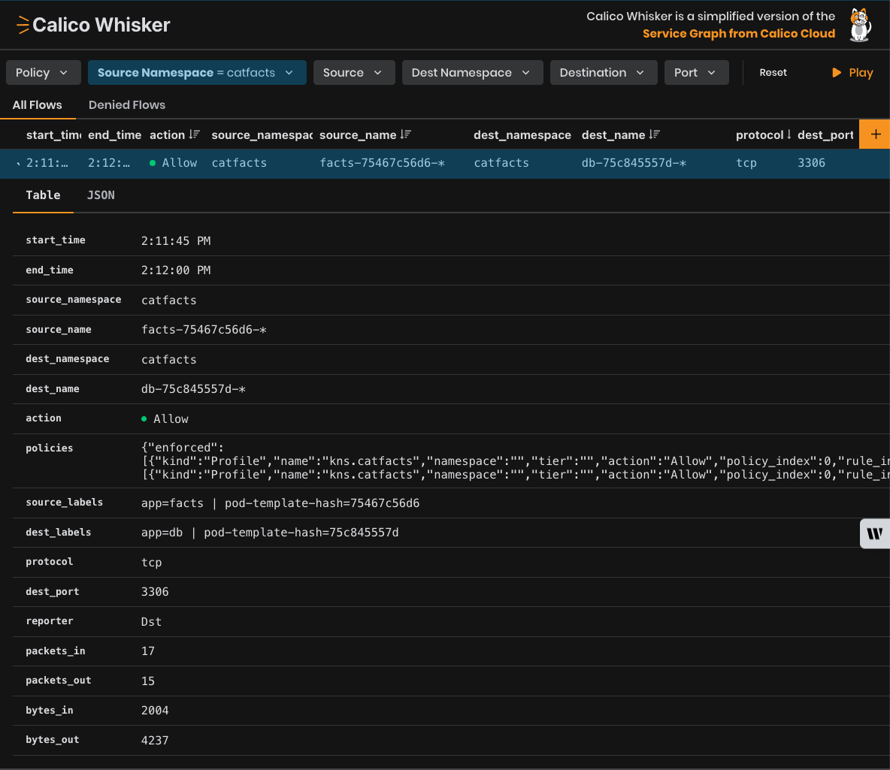
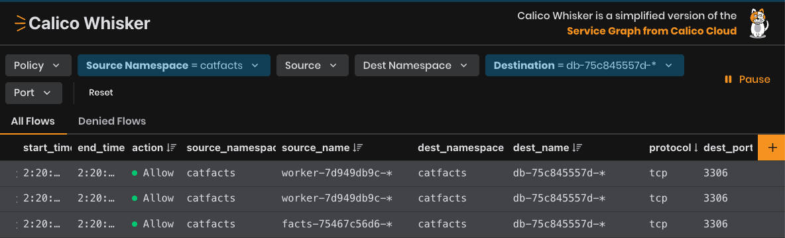
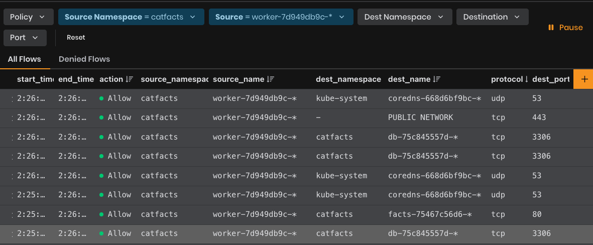
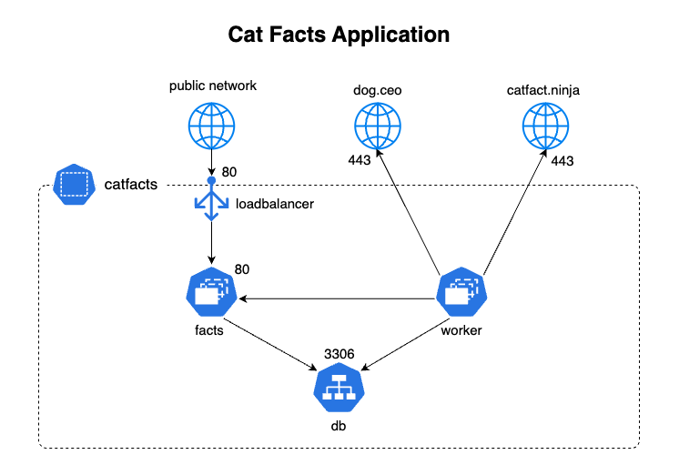
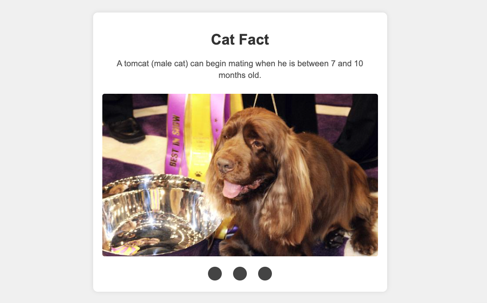
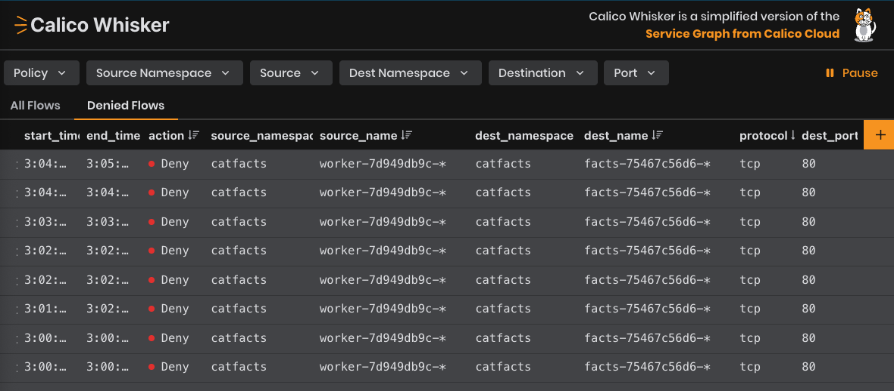

# Module 3 - Writing Network Policies

One of the best ways to make your Kubernetes cluster more secure is to use network policy to isolate namespaces. This means that you only allow the communication between namespaces that is absolutely necessary, and you block everything else. This helps to reduce the risk of an attacker moving from one part of your cluster to another if they manage to get in.

1. To start, install an application in your cluster. Deploy the catfacts application using the manifest provided:

```bash,
kubectl apply -f manifests/catfacts.yaml
```

Wait for all of the pods to be running before continuing.

```bash,
kubectl get pods -n catfacts
```

2. To write network policies, you need to know information about the traffic flows in order to secure it.

Go back to Calico Whisker (localhost:8081) in your web browser, and look for traffic from the catfacts namespace.

3.  Expand a flow log row for catfacts traffic. Here you can see all of the information that you will need to create a network policy to secure the catfacts application.
   


4.  There is a `catfacts-nwp.yaml` in the `manifests` folder. Compare it to the flow logs in Whisker to ensure they've been created correctly.

```yaml,nocopy
apiVersion: projectcalico.org/v3
kind: NetworkPolicy
metadata:
  name: application-catfacts.db
  namespace: catfacts
spec:
  tier: application-catfacts
  order: 100
  selector: app == 'db'
  types:
    - Ingress
  ingress:
    - action: Allow
      protocol: TCP
      source:
        selector: app == "worker" || app == "facts"
      destination:
        ports:
          - "3306"
``` 



By adding a filter on the destination name as `db-*` we can verify that the db pod receives incoming (ingress) traffic on port 3306 from both the `worker` and the `facts` pods.

The `worker` service has multiple egress rules to allow traffic to the `db` pod, `facts` pod, and some other domains:

```yaml
apiVersion: projectcalico.org/v3
kind: NetworkPolicy
metadata:
  name: application-catfacts.worker
  namespace: catfacts
spec:
  tier: application-catfacts
  order: 120
  selector: app == 'worker'
  types:
    - Egress
  egress:
    - action: Allow
      protocol: TCP
      destination:
        selector: app == 'facts'
        ports:
          - 80
    - action: Allow
      protocol: TCP
      destination:
        selector: all()
        ports:
          - 443
    - action: Allow
      protocol: TCP
      destination:
        selector: app == 'db'
        ports:
          - 3306
```




5.  If you continue to explore the flow logs in Calico Whisker, you should find that they match the application diagram:



6. Before applying the policies, view the catfacts application in your browser:

```kubectl port-forward -n catfacts service/facts 8080:80```

Go to `localhost:8080` in your browser and you should see a fact:



6. Apply the policies:

```kubectl apply -f manifests/catfacts-nwp.yaml```

7. Delete the facts pod to remove open connections:

```bash
kubectl get pods -n catfacts
kubectl delete pods facts-75467c56d6-dm29c -n catfacts
```

8. Revisit `localhost:8080` in your browser (possibly do a hard refresh). The page should no longer be working. You may also need to start port forwarding again.

9.  In Calico Whisker, clear all filters and go to the Denied Flows tab. You should see a lot of denied traffic going between the `worker` pod and the `facts` pod.



10. Expand one of the rows and look at the enforced policies:

```json
{"enforced":[{"kind":"CalicoNetworkPolicy","name":"facts","namespace":"catfacts","tier":"application-catfacts","action":"Deny","policy_index":0,"rule_index":0,"trigger":null}]
```

You can see here that the `facts` policy has a deny action, which is causing the traffic to be denied.

11. Edit the `application-catfacts.facts` policy and change the ingress rule to allow, instead of deny:

```kubectl edit caliconetworkpolicy application-catfacts.facts -n catfacts```

```yaml
  ingress:
    - action: Deny
      protocol: TCP
      source: {}
      destination:
        ports:
          - 80
```

to

```yaml
  ingress:
    - action: Allow
      protocol: TCP
      source: {}
      destination:
        ports:
          - 80
```

You can describe the policy to ensure the changes were made: 
```kubectl describe caliconetworkpolicy application-catfacts.facts -n catfacts```

12. In Calico Whisker you shouldn't see any more denied flows since you edited the policy, and refreshing the catfacts application at `localhost:8080` should work again.


13. We can also add some other network policies to our cluster. This policy ensures that all communication to kube dns is allowed, and any developer or application policies can't override it because it is within the `platform` tier.

```bash
kubectl apply -f -<<EOF
apiVersion: projectcalico.org/v3
kind: GlobalNetworkPolicy
metadata:
  name: platform.allow-kube-dns
spec:
  tier: platform
  order: 200
  selector: all()
  types:
  - Egress    
  egress:
    - action: Allow
      protocol: UDP
      source: {}
      destination:
        selector: k8s-app == "kube-dns"
        ports:
        - '53'
    - action: Allow
      protocol: TCP
      source: {}
      destination:
        selector: k8s-app == "kube-dns"
        ports:
        - '53'
    - action: Pass
EOF
```

>GlobalNetworkPolicy is a policy that applies cluster-wide, and doesn't target specific namespaces.


[:arrow_right: Module 4 - Network Policy Best Practices](module-4-network-policy-best-practices.md)  

[:arrow_left: Module 2 - Introducing Tiers](module-2-introducing-tiers.md) 

[:leftwards_arrow_with_hook: Back to Main](../readme.md)  