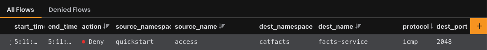

# Module 4: Network Policy Best Practices

## Staged Policies

A staged network policy resource (`StagedNetworkPolicy`) represents an ordered set of rules which are applied to a collection of endpoints that match a label selector. **These rules are used to preview network behavior and do not enforce network traffic.** For enforcing network traffic, create a network policy resource.

`StagedNetworkPolicy` is a namespaced resource. `StagedNetworkPolicy` in a specific namespace only applies to workload endpoint resources in that namespace.

## Default-Deny

A default deny network policy provides an enhanced security posture so pods without policy (or incorrect policy) are not allowed traffic until appropriate network policy is defined.

**Default allow** means all traffic is allowed by default, unless otherwise specified. **Default deny** means all traffic is denied by default, unless explicitly allowed. **Kubernetes pods are default allow**, unless network policy is defined to specify otherwise.

For compatibility with Kubernetes, Calico network policy enforcement follows the standard convention for Kubernetes pods:

If no network policies apply to a pod, then all traffic to/from that pod is allowed.
If one or more network policies apply to a pod with type ingress, then only the ingress traffic specifically allowed by those policies is allowed.
If one or more network policies apply to a pod with type egress, then only the egress traffic specifically allowed by those policies is allowed.
For other endpoint types (VMs, host interfaces), the default behavior is to deny traffic. Only traffic specifically allowed by network policy is allowed, even if no network policies apply to the endpoint.

1. Create a default-deny policy for the `catfacts` namespace (because we've already created workload isolation policies for that application) that will be evaluated last in the `application-catfacts` tier.

```bash
kubectl apply -f -<<EOF
apiVersion: projectcalico.org/v3
kind: NetworkPolicy
metadata:
  name: application-catfacts.default-deny
  namespace: catfacts
spec:
  tier: application-catfacts
  order: 100000
  selector: all()
  types:
    - Ingress
    - Egress
EOF

2. Create a *staged* default-deny policy for the `quickstart` namespace.

```bash
kubectl apply -f -<<EOF
apiVersion: projectcalico.org/v3
kind: StagedNetworkPolicy
metadata:
  name: default.default-deny-quickstart
  namespace: quickstart
spec:
  tier: default
  order: 1000
  selector: all()
  types:
    - Ingress
    - Egress
EOF
```

3. Test access from the busybox pod to the facts service and the nginx service:

```kubectl run --namespace=quickstart access --rm -ti --image busybox /bin/sh```

```bash
wget -qO- http://nginx
```
```bash
wget -qO- facts.catfacts
```

4. Check Calico Whisker to see if the policy is working. Add a filter for the source traffic to be from the `quickstart` namespace and the `access` pod. Expand any of the traffic flows to `nginx` or the `facts` service. In the Policy row, you should see in the _pending_ data the staged network policy:

```json
{"kind":"StagedNetworkPolicy","name":"default-deny-quickstart","namespace":"quickstart","tier":"default","action":"ActionUnspecified","policy_index":0,"rule_index":0,"trigger":null}
```

>The policy is pending because it's currently staged and not yet enforced and not altering any traffic flows. It's a good way to ensure that the policy will be evaluated on the correct flows.

5. Enforce the policy and delete the staged policy:

```bash
kubectl apply -f -<<EOF
apiVersion: projectcalico.org/v3
kind: NetworkPolicy
metadata:
  name: default.default-deny-quickstart
  namespace: quickstart
spec:
  tier: default
  order: 1000
  selector: all()
  types:
    - Ingress
    - Egress
EOF
```

```bash
kubectl delete stagednetworkpolicy default.default-deny-quickstart -n quickstart
```

6. Test access from the busybox pod to the facts service and the nginx service:

```kubectl run --namespace=quickstart access --rm -ti --image busybox /bin/sh```

```bash
wget -qO- http://nginx
```
```bash
wget -qO- facts.catfacts
```

You should start to see denied flows in Calico Whisker.


## Network Sets

A **network set** resource is an arbitrary set of IP subnetworks/CIDRs that can be matched by standard label selectors in Kubernetes or Calico network policy. This is useful to reference a set of IP addresses using a selector from a namespaced network policy resource. It is typically used when you want to scale/reuse the same set of IP addresses in policy.

A global network set resource is similar, but can be selected only by Calico global network policies.

1. Create a netowrk set for the facts service:

First, get the IP address of the facts service:
```kubectl describe svc/facts -n catfacts```

Then create the network set, adding in the correct IP:
```bash
kubectl apply -f -<<EOF
apiVersion: projectcalico.org/v3
kind: NetworkSet
metadata:
  namespace: catfacts
  name: facts-service
  labels:
    catfacts: 'true'
spec:
  nets:
    - 10.96.210.232
EOF


2. Test access from the busybox pod to the facts service, replacing the IP address with the correct address for the facts service.

```kubectl run --namespace=quickstart access --rm -ti --image busybox /bin/sh```

```bash
ping 10.96.210.232
```
3. Check Whisker and you will see denied flows that reference the network set: `facts-service`:




[:arrow_right: Module 5 - Calico Cloud Free Tier](module-5-calico-cloud-free-tier.md)  

[:arrow_left: Module 3 - Writing Network Policy](module-3-writing-network-policy.md) 

[:leftwards_arrow_with_hook: Back to Main](../readme.md)  