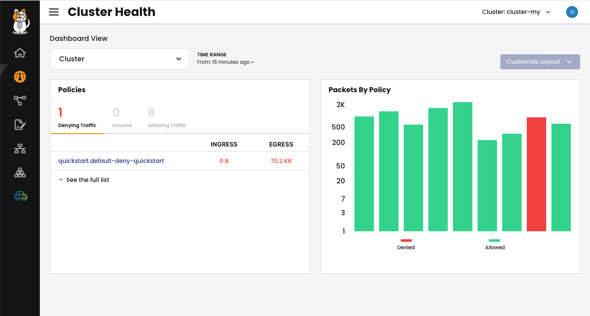
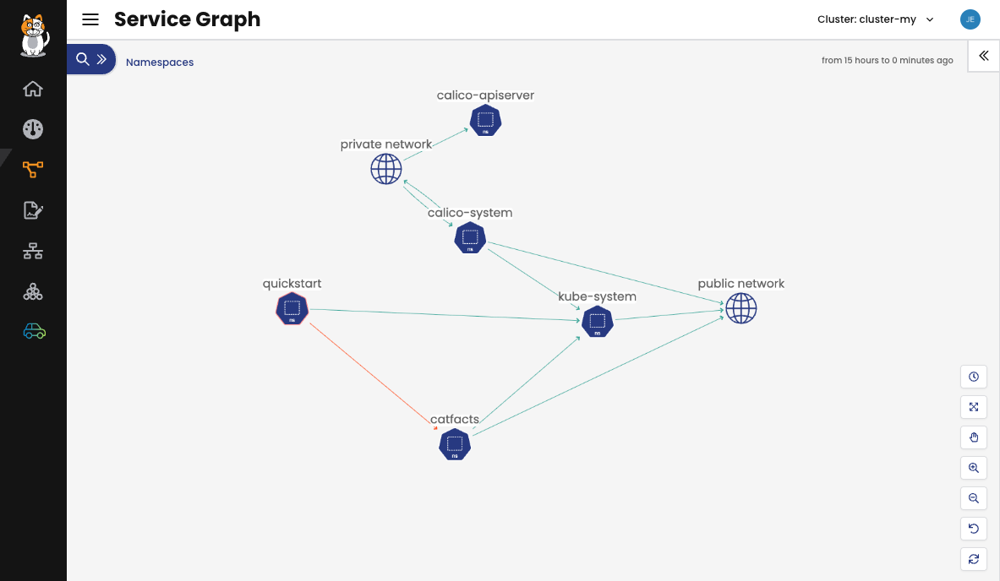
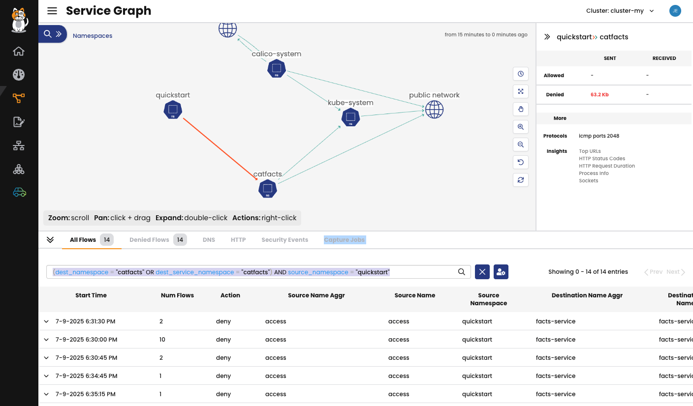
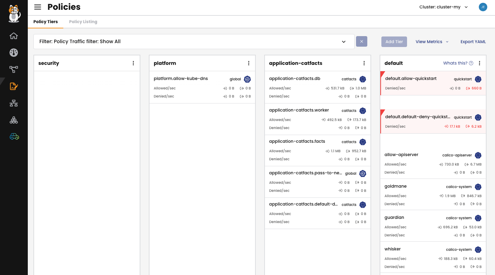
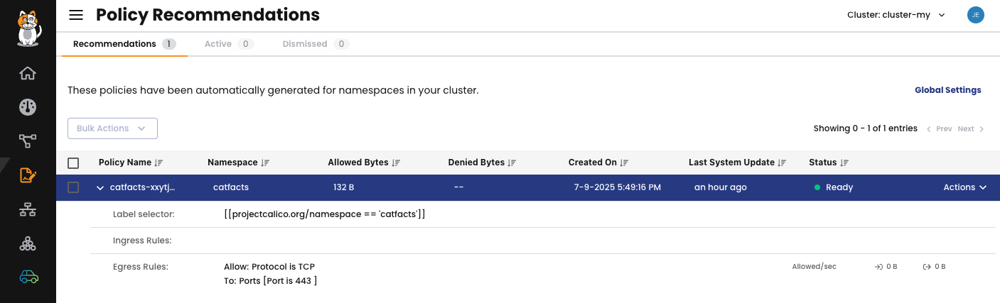
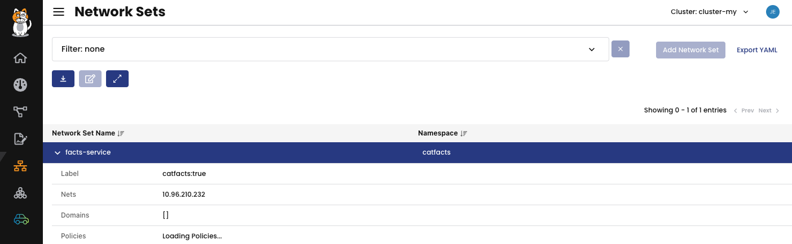

# Module 5: Calico Cloud Free Tier

As you explore Whisker, you may notice in the top references to [Calico Cloud](calicocloud.io).

It takes just a few seconds to connect your cluster to Calico Cloud.

[Take a tour of Calico Cloud Free Tier](https://demo.arcade.software/eWC0DGSIaEIyPMPyNasN?embed&embed_mobile=tab&embed_desktop=inline&show_copy_link=true)

Sign up for Calico Cloud free Tier and connect your cluster following the instructions.

Explore all of the insights and observability it offers:

## Dashboards

There are 3 dashboards available: cluster health, flow logs and traffic volume.
Use these dashobard for ongoing monitoring and quick insights into your cluster networking.

## Service Graph

Service Graphs takes all of the collected flow logs and turns it into a visualization enabling you to contextualize and filter flows faster.

Clicking on flow lines between objects auto-filters the flow logs and gives you other insights, so you can continue to use Calico Cloud Free Tier, or Whisker, to help build and validate network policies.

## Policies

View all of your policies and instantly see which policies belong in which tier, how they're ordered, and whether they're staged, global, or denying traffic for more efficient policy organization.

## Policy recommendations

Speed up cluster network security by enabling automatic policy recommendations. Based on flow logs, Calico automatically builds namespace isolation policies, saving hoursof work building and refining network policies.

## Network Sets

View all of the network sets and which polcies, if any, they're associated with. Network sets are also visible on the Service Graph if there are any pods communicating with them.

[:arrow_left: Module 4 - Network Policy Best Practices](module-4-network-policy-best-practices.md) 

[:leftwards_arrow_with_hook: Back to Main](../readme.md)  